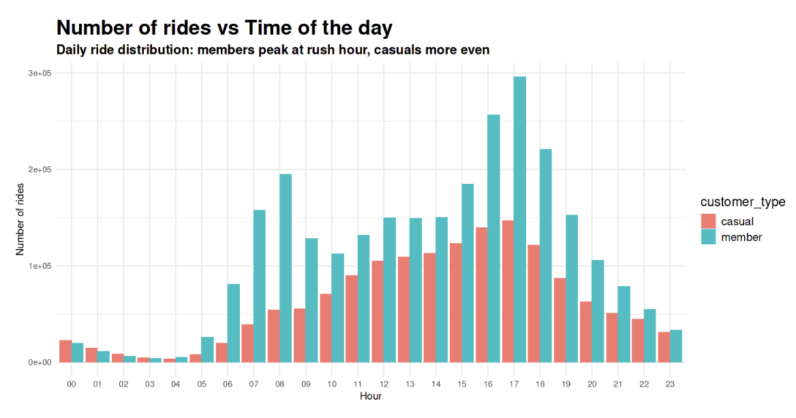
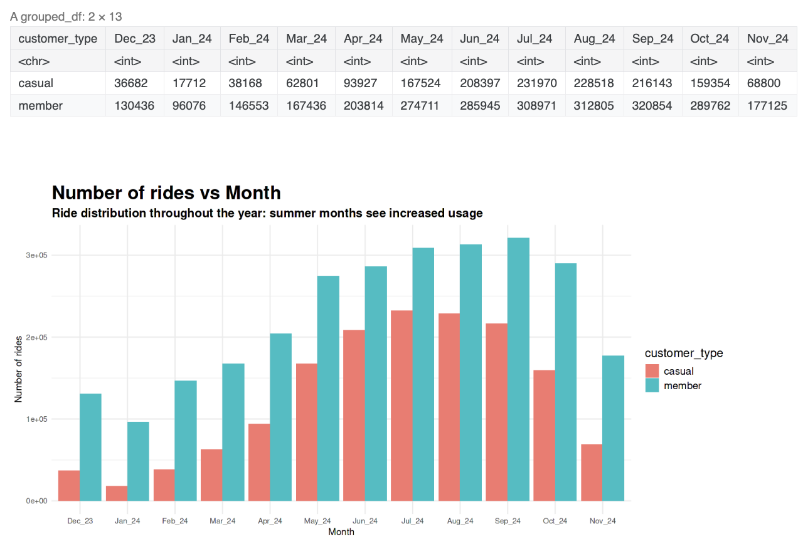
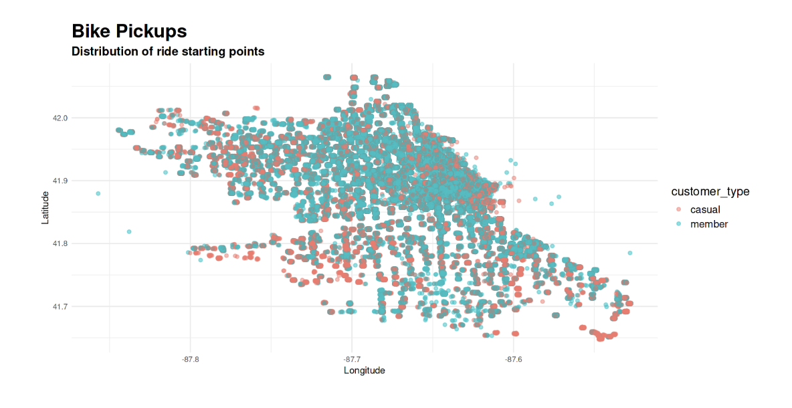

## magdalenarotw.github

### Education
* Project Design, Pontificia Universidad Catolica de Chile
* Business Statistics and Analysis Specialization, Rice University
* Google Data Analytics Professional Certificate

### Unlocking Bike-Share Success: Strategic Guide, R Programming
Analysis of usage between customers for a bike-share company based on the six-step framework process: Ask, Prepare, Process, Analyze, Share and Act as part of the Google Data Analytics Certificate Capstone Project.
 
R Programming | Jupyter Notebook
  

 
[View Code and more details on Kaggle](https://www.kaggle.com/code/mjrwww/unlocking-bike-share-success-strategic-guide)
  
