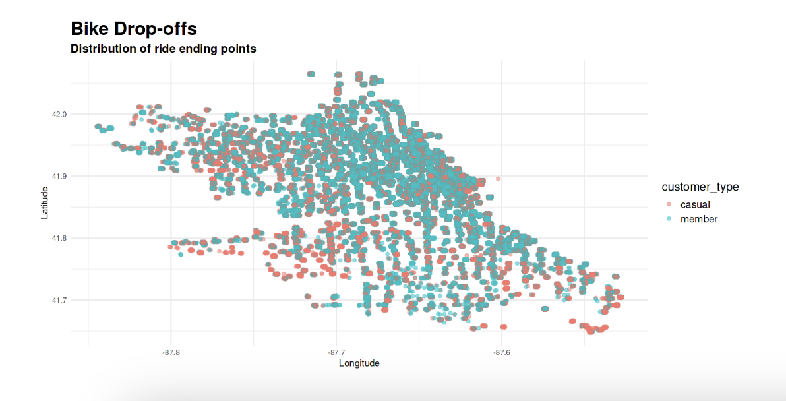

## About Me
A designer who loves diverse challenges. By applying design thinking principles and maintaining a strong commitment to data integrity, I create innovative and effective solutions. I’m always learning new technologies to produce data-informed work that makes a real impact.

---

## Portfolio

---

#### Case study: 
### Unlocking Bike-Share Success: Strategic Guide

Google Data Analytics Certificate Capstone Project: Analysis of usage patterns between customers for a bike-share company using the six-step data analysis framework: Ask, Prepare, Process, Analyze, Share and Act.

**Technologies:** R Programming, Jupyter Notebook

**Key Insights:**
- Identified usage patterns between different customer segments
- Provided actionable recommendations for business growth
- Applied statistical analysis and data visualization techniques

[View Complete Analysis on Kaggle](https://www.kaggle.com/code/mjrwww/unlocking-bike-share-success-strategic-guide)

---

#### Case study: 
### Bock

**The Problem:** 
Bock, a small B2C fashion brand, was struggling with a lack of brand identity and low sales. They needed a complete brand revitalization to connect with their target audience and drive growth.

**My Role:** 
Product Designer, Product Strategy, User Research, Visual Design, etc.

**The Solution:**
I led a complete brand redesign and a new product strategy, transforming Bock from a generic brand into a community-focused 'active-ravewear' brand with a strong social mission.
[Visit the Bock website](https://en.bock-fairwear.com/)

**Research & Strategy:**
Uncovering the Challenge: Use a compelling title for this section. Describe the initial brainstorming session with the CEO and what you learned. Mention the lack of clear vision, voice, and a cohesive sales strategy.

Understanding the Audience: Instead of just listing the personas, explain what the personas taught you. "I developed personas like Anna, Paul, and Viviana to understand our target demographic—young, active, and socially conscious individuals in urban settings. This research revealed a desire for clothing that fits their lifestyle, from a morning coffee to a night out dancing."

Defining the Competitive Edge: Explain how your market and competitive analysis led to your unique positioning. "My analysis of the fashion market in Berlin revealed a gap. I saw an opportunity for Bock to become an active-ravewear brand. This unique positioning, combined with a strong social responsibility component (donating profits to support the cultural scene), became our key competitive advantage."

**Design & Implementation**
The Brand Brief: Explain how you translated your research into a tangible guide. "I developed a comprehensive Brand Brief that defined the new brand's voice, mission, vision, and culture. This document served as the North Star for all design and marketing decisions."

Revitalizing the Online Platform: Describe the redesign process. Mention how you focused on enhancing the user experience, functionality, and brand consistency to better communicate the new identity.

**Project Impact & Results**
Quantifiable Success: This is the most important section. Use strong, action-oriented language to highlight your results:

20% increase in sales following the re-launch.

Achieved 90% positive brand perception among the target audience in a post-launch evaluation.

Successfully communicated the new brand identity and created a unique competitive edge.

**Skills:** UX/UI, Market Research, Customer Segmentation, Marketing Strategy

---

## Additional Projects
*More projects coming soon - currently working on expanding my portfolio with additional data science and UX case studies.*

---

## Technical Skills
- **Programming:** Python, R, SQL
- **Data Analysis:** Statistical Analysis, Data Visualization, Business Intelligence
- **Design & UX:** User Research, Interface Design, User Experience Strategy
- **Business:** Project Management, Marketing Operations, Strategic Analysis
- **Tools:** Jupyter Notebook, BI Tools, R Studio

---

## Education & Certifications
- **Licenciatura** - Pontificia Universidad Católica de Chile
- **Business Statistics and Analysis Specialization** - Rice University
- **Google Data Analytics Professional Certificate**

---

## Let's Connect
I'm always interested in discussing data science, UX design, and innovative project opportunities.

Contact me for collaboration opportunities  
[LinkedIn Profile](https://www.linkedin.com/in/magdalena-rojas-w/)  
