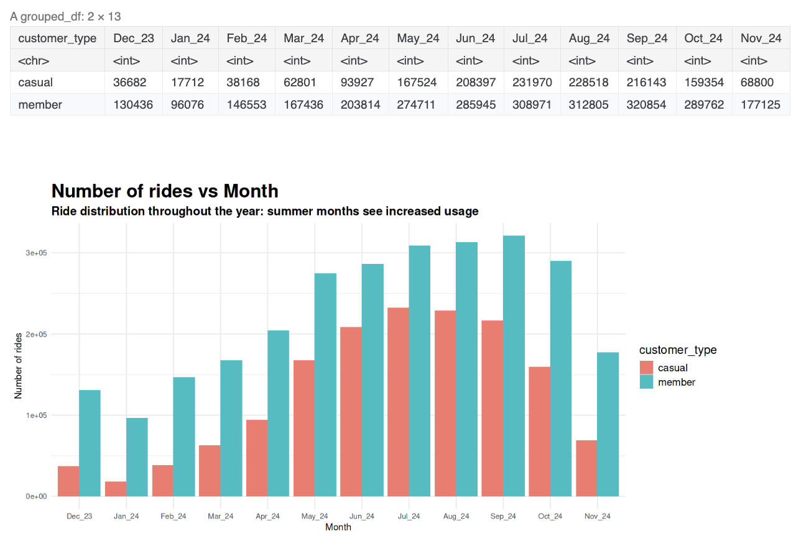
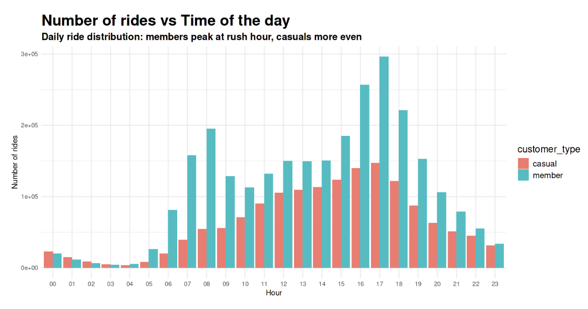

# Magdalena RojasW - Portfolio

## About Me
Project Designer transitioning into Data Science with expertise in Python, SQL, BI tools, UX & Marketing Operations. I combine analytical thinking with design sensibility to solve complex business problems.

---

## Featured Project

### 🚴‍♀️ Unlocking Bike-Share Success: Strategic Guide
**Google Data Analytics Certificate Capstone Project**

Analysis of usage patterns between customers for a bike-share company using the six-step data analysis framework: Ask, Prepare, Process, Analyze, Share and Act.

**Technologies:** R Programming | Jupyter Notebook

**Key Insights:**
- Identified usage patterns between different customer segments
- Provided actionable recommendations for business growth
- Applied statistical analysis and data visualization techniques

[View Complete Analysis on Kaggle](https://www.kaggle.com/code/mjrwww/unlocking-bike-share-success-strategic-guide)

---

## Additional Projects
*More projects coming soon - currently working on expanding my portfolio with additional data science and UX case studies.*

---

## Technical Skills
- **Programming:** Python, R, SQL
- **Data Analysis:** Statistical Analysis, Data Visualization, Business Intelligence
- **Design & UX:** User Research, Interface Design, User Experience Strategy
- **Business:** Project Management, Marketing Operations, Strategic Analysis
- **Tools:** Jupyter Notebook, BI Tools, R Studio

---

## Education & Certifications
- **Licenciatura** - Pontificia Universidad Católica de Chile
- **Business Statistics and Analysis Specialization** - Rice University
- **Google Data Analytics Professional Certificate**

---

## Let's Connect
I'm always interested in discussing data science, UX design, and innovative project opportunities.

📧 Contact me for collaboration opportunities  
💼 [LinkedIn Profile](https://www.linkedin.com/in/magdalena-rojas-w/)  
💻 [View My GitHub Projects](https://github.com/magdalenarojasw)
